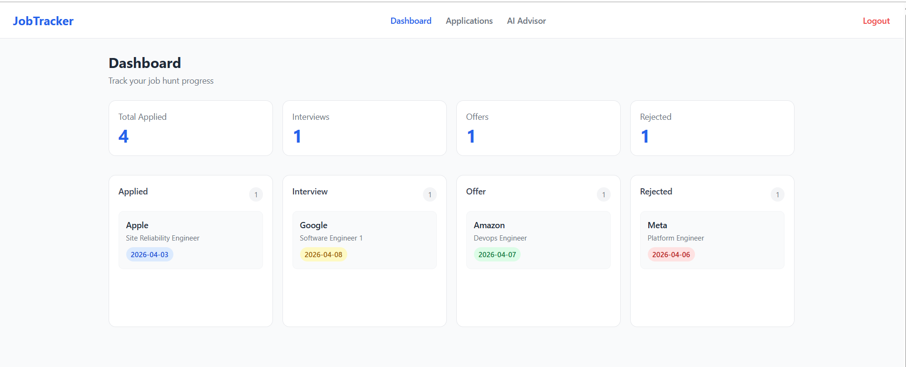
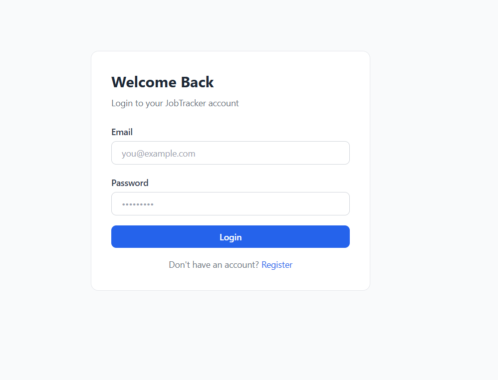
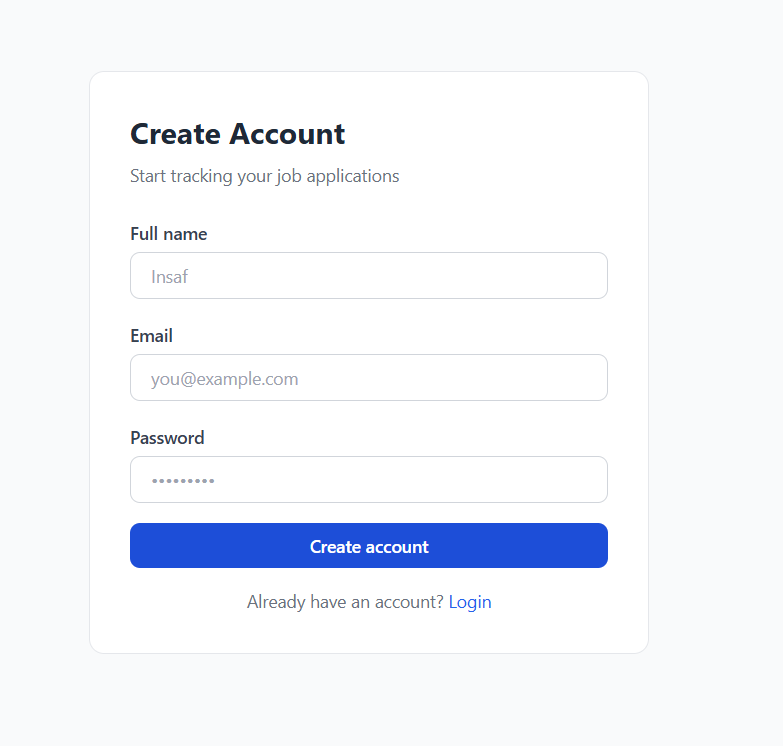
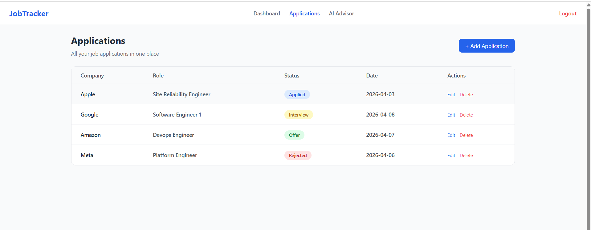
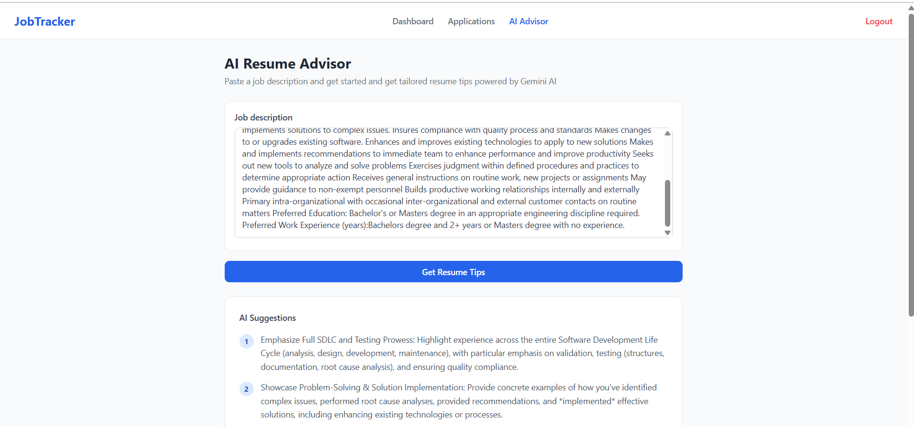

# Job Tracker — Full Stack Spring Boot + React App

A full-stack web application to track job applications with an AI-powered resume advisor.

**Live Demo:** [https://job-tracker-hazel.vercel.app/](https://job-tracker-hazel.vercel.app/)  
**Backend API:** [https://job-tracker-production-7395.up.railway.app/](https://job-tracker-production-7395.up.railway.app/)

---

## 🖼️ Preview



---

## Features

- JWT authentication (register, login, protected routes)
- Track job applications with status, company, role, date, and notes
- Kanban board — drag cards across Applied / Interview / Offer / Rejected
- Stats dashboard — application trends and status breakdown chart
- AI Resume Advisor — paste a job description, get tailored resume tips (Gemini API)

---

## Tech Stack

| Layer    | Technology                                            |
| -------- | ----------------------------------------------------- |
| Backend  | Spring Boot 3, Spring Security, Spring Data JPA       |
| Auth     | JWT (jjwt library)                                    |
| Database | PostgreSQL                                            |
| Frontend | React 18, Vite, React Router v6                       |
| State    | Context API + custom hooks                            |
| HTTP     | Axios                                                 |
| AI       | Google Gemini API                                     |
| Hosting  | Railway (backend), Vercel (frontend), Neon (database) |

---

## 🔐 Demo Credentials

Use this account to quickly test the app without registering:

- 📧 Email: `demo@jobtracker.com`
- 🔑 Password: `demo123`

---

## 📸 Screenshots (Proof)

### 🔑 Login Page



### 📝 Register Page



### 📊 Dashboard


### 📋 Applications Page



### 🤖 AI Advisor



---

## Architecture

```
React (Vercel)  <-->  Spring Boot REST API (Railway)  <-->  PostgreSQL (Neon)
                                  |
                          Google Gemini API
```

---

## Local Setup

### Prerequisites

- Java 17+
- Node.js 18+
- Docker (optional, for one-command setup)

### Option A — Docker (recommended)

```bash
git clone https://github.com/yourusername/job-tracker.git
cd job-tracker
docker-compose up
```

App runs at `http://localhost:5173`

### Option B — Manual

**Backend:**

```bash
cd backend
cp src/main/resources/application.yml.example src/main/resources/application.yml
# Fill in your DB url and JWT secret
./mvnw spring-boot:run
```

**Frontend:**

```bash
cd frontend
cp .env.example .env
# Set VITE_API_BASE_URL=http://localhost:8080
npm install && npm run dev
```

---

## API Endpoints

| Method | Endpoint                 | Auth | Description           |
| ------ | ------------------------ | ---- | --------------------- |
| POST   | `/api/auth/register`     | No   | Create account        |
| POST   | `/api/auth/login`        | No   | Get JWT token         |
| GET    | `/api/applications`      | Yes  | List all applications |
| POST   | `/api/applications`      | Yes  | Add application       |
| PUT    | `/api/applications/{id}` | Yes  | Update application    |
| DELETE | `/api/applications/{id}` | Yes  | Delete application    |
| POST   | `/api/ai/resume-tips`    | Yes  | Get AI resume advice  |

---

## Roadmap

- [ ] Email reminders for follow-ups
- [ ] Resume upload and parsing
- [ ] Export applications to CSV
- [ ] Dark mode

---

## Author

Insaf Ahmedh — [LinkedIn](https://www.linkedin.com/in/insaf-ahmedh/) · [Portfolio](https://inscode.github.io/)
